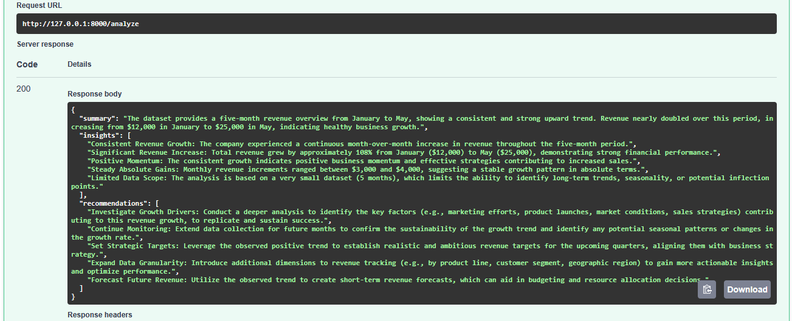

# AI Report Generator

AI-powered business reporting application built with FastAPI, Pandas, and Large Language Models (LLMs).

The application analyzes CSV and Excel datasets, generates dataset summaries, extracts business insights, and produces strategic recommendations using AI.

The project supports both local LLMs through Ollama and cloud-hosted LLMs through Google Gemini.

---

# Features

## Data Upload

- CSV file support
- Excel (.xlsx) file support

## Data Analysis

- Automatic dataset inspection
- Row and column analysis
- Data type detection
- Sample data extraction

## AI-Powered Reporting

Generates:

- Executive summaries
- Key business insights
- Strategic recommendations

## Configurable AI Providers

Choose between:

- Ollama (local)
- Google Gemini (cloud)

using a simple `.env` configuration.

---

# Demo



---

# Example Dataset

| Month    | Revenue |
| -------- | ------: |
| January  |   12000 |
| February |   15000 |
| March    |   18000 |
| April    |   22000 |
| May      |   25000 |

---

# Example Response

```json
{
  "summary": "The dataset provides a five-month revenue overview from January to May, showing a consistent and strong upward trend. Revenue nearly doubled over this period, increasing from $12,000 in January to $25,000 in May, indicating healthy business growth.",
  "insights": [
    "Consistent Revenue Growth: The company experienced a continuous month-over-month increase in revenue throughout the five-month period.",
    "Significant Revenue Increase: Total revenue grew by approximately 108% from January ($12,000) to May ($25,000), demonstrating strong financial performance.",
    "Positive Momentum: The consistent growth indicates positive business momentum and effective strategies contributing to increased sales."
  ],
  "recommendations": [
    "Investigate Growth Drivers to understand factors contributing to revenue growth.",
    "Continue monitoring future performance to validate long-term trends.",
    "Use the observed trend to create revenue forecasts and support business planning."
  ]
}
```

---

# Technology Stack

- Python 3.12+
- FastAPI
- Pydantic
- Pandas
- OpenPyXL
- Google Gemini
- Ollama
- python-dotenv
- Uvicorn
- pytest

---

# Architecture

```text
CSV / Excel File
        ↓
Pandas Analysis
        ↓
Dataset Summary
        ↓
Prompt Builder
        ↓
AI Provider Factory
        ↓
Gemini or Ollama
        ↓
Business Report
```

---

# Configuration

Create a `.env` file in the project root.

Example:

```env
# AI provider
# gemini | ollama

AI_PROVIDER=gemini

# Gemini
GEMINI_API_KEY=your_api_key_here

# Ollama
OLLAMA_MODEL=qwen2.5:7b
```

---

# Installation

Clone the repository:

```bash
git clone <repository-url>

cd ai-report-generator
```

Create a virtual environment:

```bash
python -m venv .venv
```

Activate the environment.

Windows:

```bash
.venv\Scripts\activate
```

Linux/macOS:

```bash
source .venv/bin/activate
```

Install dependencies:

```bash
pip install -r requirements.txt
```

---

# Running the Application

Start FastAPI:

```bash
uvicorn app.main:app --reload
```

Open Swagger UI:

```text
http://127.0.0.1:8000/docs
```

---

# API Endpoint

## POST /analyze

Upload:

- CSV file
- Excel (.xlsx) file

Response:

```json
{
  "summary": "...",
  "insights": ["..."],
  "recommendations": ["..."]
}
```

---

# Supported File Types

| File Type | Supported |
| --------- | --------- |
| CSV       | Yes       |
| XLSX      | Yes       |
| XLS       | No        |

---

# Testing

Run tests:

```bash
pytest
```

---

# Future Improvements

- Multi-sheet Excel support
- Data visualization
- PDF report export
- Interactive dashboard
- Confidence scoring
- Docker deployment
- GitHub Actions CI/CD
- Scheduled report generation

---

# Why This Project

This project demonstrates:

- Python backend development
- FastAPI REST APIs
- Pandas data analysis
- Spreadsheet processing
- Prompt engineering
- AI integration
- Provider abstraction
- Structured LLM outputs
- Software architecture

Suitable as a portfolio project for Python Developer, Data Analyst, AI Engineer, Machine Learning Engineer, and Generative AI Developer roles.
